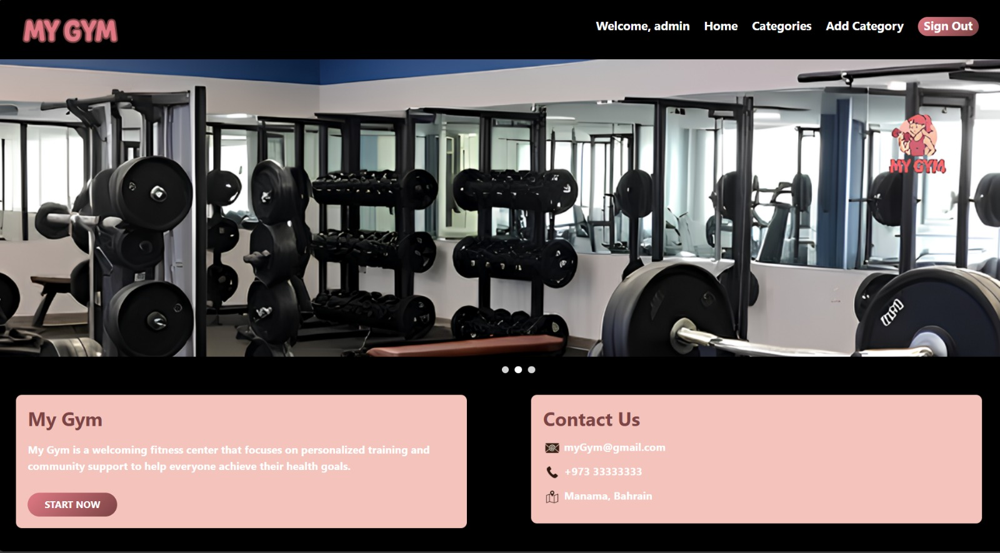

# 🏋️ MuGym

## 📝 Project Description

**MuGym** is a fitness management web application where users can explore different gym categories, join training sessions, and interact with instructors.  
Each category includes multiple sessions, and signed-in users can leave reviews on sessions they attended.  
We built MuGym to provide a collaborative, community-driven fitness and training experience.

This project was developed as part of a **MERN Stack full-stack development requirement**:

- **Frontend:** React for a dynamic, interactive UI.  
- **Backend:** FastAPI for server-side functionality and RESTful APIs.  
- **Database:** PostgreSQL for relational data storage and management.  
- **Authentication & Authorization:** Implemented on both frontend and backend using JWT.  
- **CRUD Operations:** Full create, read, update, and delete functionality for users, categories, sessions, and reviews.  
- **Planning:** Created ERD, user stories, and wireframes before development.  

## 🚀 Getting Started

### 📋 Planning Materials
- [Planning Docs](https://trello.com/b/LCi6tScH/unite-4-project)

### 🗄️ Back-End Repository
- [MuGym Back-End](https://github.com/zainabalabboodSEB7/myGym-back-end.git)

### How to Use
1. **Sign up** or **Sign in** to your account.
2. Explore available categories (e.g., Yoga, Strength, Cardio).
3. Join sessions under each category with details like instructor, schedule, and description.
4. Browse other users’ reviews for different sessions.
5. Leave a review or rating on any session if you are signed in.

## ✨ Features

- User authentication with **Sign Up / Sign In**.
- **Create, update, and delete categories**.
- **Add, edit, and remove sessions** with instructor, schedule, and description.
- **View other categories** and browse their sessions.
- **Session details page** with reviews and ratings.
- **Leave reviews/comments** on any session (if signed in).
- Planned features: booking & payments, search & filtering, user profile page.

## 💡 Technologies Used

- **Frontend:** React, React Router  
- **Backend:** FastAPI  
- **Database:** PostgreSQL  
- **Authentication:** JWT  
- **Styling:** React-Bootstrap  

## 📚 Attributions
- [Montserrat Font](https://fonts.googleapis.com/css2?family=Montserrat:wght@500;700&display=swap)

## 🚧 Next Steps

- Implement session booking and payment flow
- Add search and filtering functionality
- Enable image uploads for sessions and categories
- Add user profile page
